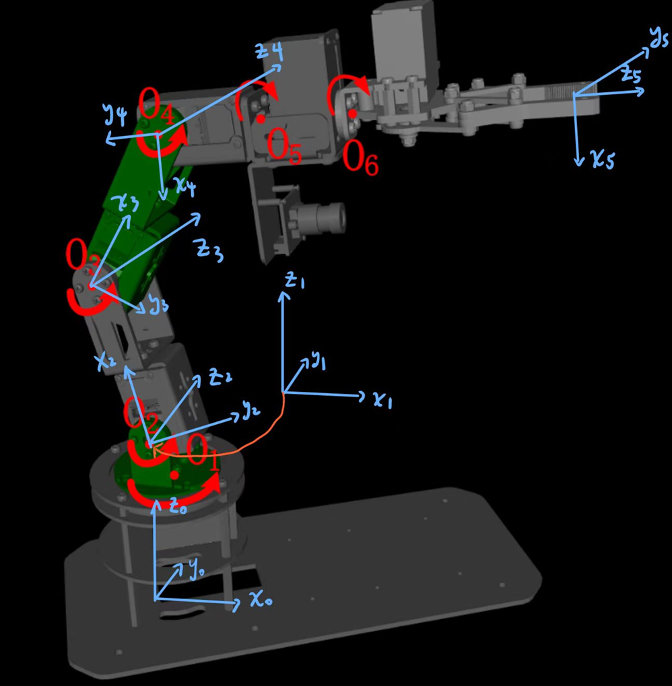
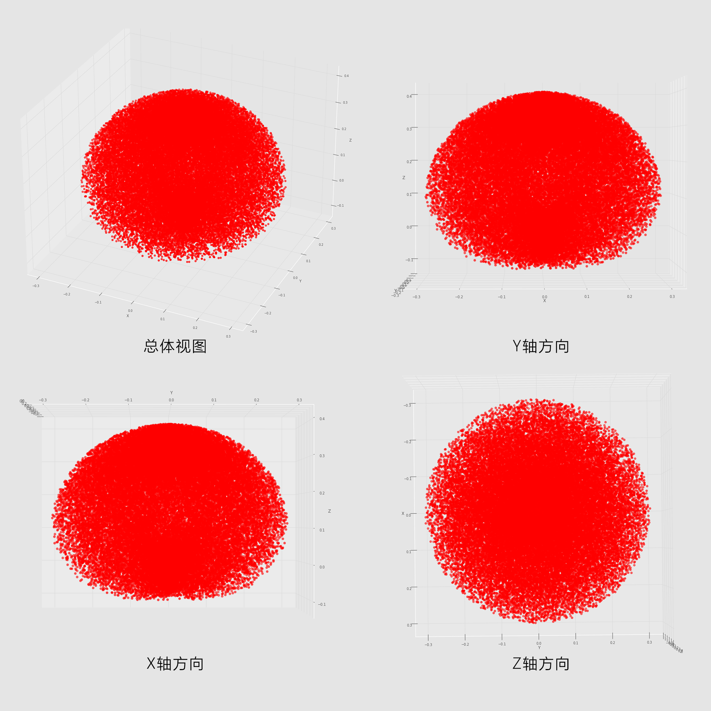

# 机械臂——仿真与控制

## 效果演示

## 仿真部分

### 建立坐标系

整理成DH参数矩阵有：

| $i$| $a_{j-1}$ | $α_{j-1}$ |$θ_j$ | $d_j$ |
|---|---------|---------|-----|-----|
| 1 | 0     | 0    | q1  | 0.1045 |
| 2 | 0     | -90° | q2 - 90° | 0 |
| 3 | 0.08285 | 0    | q3  | 0 |
| 4 | 0.08285 | 0   | q4 + 90° | 0 |
| 5 | 0     | 90° | q5  | 0.12842 |

### 正逆运动学求解

正运动学求解示例：

.png)
.png)

逆运动学求解示例：

.png)
.png)

### 机械臂工作空间求解

### 机械臂抓取物体仿真

`main_ddh2.py`实现了一个基于状态机的机械臂控制流程，主要思路如下：

1. **初始化**:
   - 创建机械臂仿真环境 (`DofbotEnv`) 并重置。
   - 定义常量（如夹爪默认角度、夹紧角度等）和状态机的各个状态（`INITIAL_STATE`, `GRASP_STATE`, `LIFT_STATE`, `PUT_STATE`, `MOVE_STATE`, `BACK_STATE`）。
   - 初始化机械臂的初始关节角度和目标物块的偏移量。

2. **状态机控制流程**:
   - **`INITIAL_STATE`**: 
     - 计算目标物块的抓取位置（通过偏移量调整）。
     - 使用逆运动学计算目标关节角度，并控制机械臂移动到目标位置。
     - 检查机械臂是否到达目标位置，若到达则进入 `GRASP_STATE`。
   - **`GRASP_STATE`**:
     - 控制机械臂移动到抓取位置，并关闭夹爪抓取物块。
     - 等待 1 秒后进入 `LIFT_STATE`。
   - **`LIFT_STATE`**:
     - 控制机械臂将物块抬高一定高度。
     - 检查是否到达目标位置，若到达则进入 `MOVE_STATE`。
   - **`MOVE_STATE`**:
     - 控制机械臂移动到目标区域的上方位置。
     - 检查是否到达目标位置，若到达则进入 `BACK_STATE`。
   - **`BACK_STATE`**:
     - 控制机械臂将物块放置到目标区域。
     - 等待 1 秒后释放夹爪，完成放置。

3. **关键功能**:
   - 使用 `env.dofbot_setInverseKine` 计算目标位置的逆运动学解。
   - 使用 `env.dofbot_control` 控制机械臂的关节角度和夹爪角度。
   - 使用 `env.get_dofbot_jointPoses` 检查机械臂当前关节状态是否接近目标状态。
   - 使用 `env.get_block_pose` 和 `env.get_target_pose` 获取物块和目标区域的位姿。

4. **终止条件**:
   - 当物块成功放置到目标区域后，`Reward` 变量被设置为 `True`，结束循环。

该算法通过状态机逐步控制机械臂完成抓取、抬升、移动和放置物块的任务。每个状态都有明确的目标位置和动作逻辑，确保机械臂按顺序完成任务。

## 项目结构

1. **根目录**:
   - main.py, main_ddh2.py, : 主程序文件，包含机械臂的控制逻辑和状态机实现。
   - main_todo.py：初始的主程序文件。
   - data_analyse.py: 数据分析脚本，用于解析和可视化机械臂的状态和目标数据。
   - dh_kine_demo.py: 使用DH参数进行机械臂正逆运动学计算的示例。
   - dofbot.py: 机械臂仿真环境的核心实现，包括机械臂的运动学、控制和仿真逻辑。
   - README.md: 项目说明文件。
   - t.txt: 数据文件，存储机械臂的状态和目标角度。

2. **模型文件夹** (models):
   - 包含机械臂和环境的URDF模型文件，如`box_blue.urdf`, box_green.urdf, dofbot_with_gripper.urdf等。
   - 子文件夹：
     - `cup/`: 被抓物体模型。
     - `dofbot_urdf_with_gripper/`: 带夹爪的机械臂模型。
     - `table_collision/`: 桌子模型。

3. **输出文件夹** (output):
   - 存储仿真生成的图片，如机械臂的工作空间图。

4. **作图文件夹** (作图):
   - 包含设计相关的图像文件，如`工作空间.psd`。
